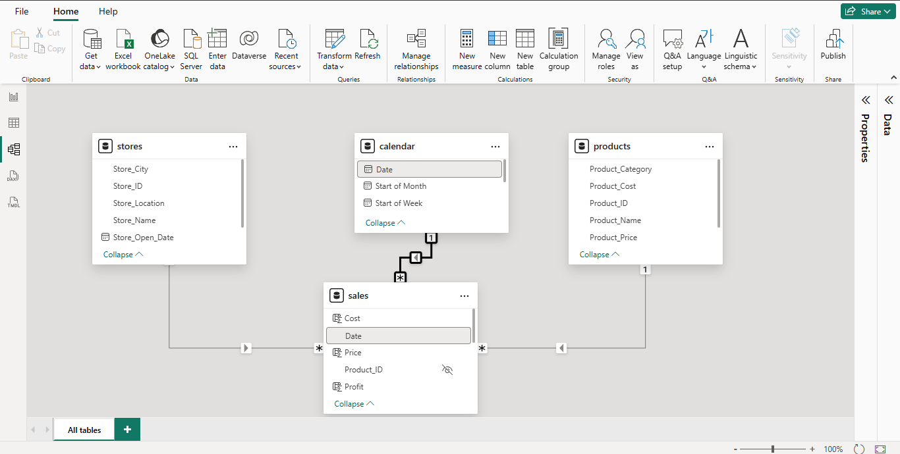

# Maven Toys Store Sales Analysis

### Table of Content

- [Introduction](#introduction)
- [Project Overview](project_overview)
- [Data Source](data_source)
- [Software Used](software_used)
- [Skills Demonstrated](skills_demonstrated)
- [Data Transformation](data_transformation)
- [Data Modelling](data_modelling)
- [Data Analysis and Visualization](data_analysis_and_visualization)
- [Recommendations and Conclusion](recommendations_and_conclusion)
- [Tips](tips)

### Introduction

This Data Analysis Project was birthed in course of my work with the Digitaley Drive Team. The dataset was provided by the Team and I have been saddled with the interesting task of cleaning, visualing and analysing it.
Kindly follow along for a wonderful experience as I explore the data visualization world of Power Bi Desktop and Micrsosoft PowerPoint to analyze the data.

### Project Overview

This Project delves into the Maven Toys Store dataset over the period of January 2022 to September 2023 to analyse various areas of their sales performance during the said period. This would enable us identify trends, gain deep understanding of the Store's performance and make data-driven recommendations.

### Data Source

This analysis comprises of 4 Tables :

1. Calendar with 1 column and 638 rows; 
2. Products with 5 columns and 35 rows;
3. Sales with 9 columns and 829,262 rows; and
4. Stores with 5 columns and 50 rows.

The 'sales' table is the primary dataset used for this analysis in the "sales.csv" file, containing detailed information about all sales made by all Maven Toys Stores.

### Software Used

- Microsoft Power Bi - Version: 2.142.928.0 64-bit (April 2025)
- Microsoft PowerPoint 2016 MSO (16.0.4266.1001) 64-bit

### Skills Demonstrated

- Data Cleaning
- Measures
- Filtering Data
- Data Visualization
- Annotation

### Data Transformation

The datasets were efficiently cleaned and transformed in the Power Query Editor of my Power Bi Desktop with the performed tasks outlined seriatim :

1. Including 2 more columns in my "caledar.csv" being `Start of Month` and `Start of Week` from the 'Date' dropdown of the 'Add Column' tab. This is to enable me easily draw visual analysis during data visualization. See uploaded picture "mts_power_query_editor.png".

2. Changed the datatypes of all the columns with dates to reflect the right datatype, that is, from 'Number' to 'Date'.
3. 'Close & Apply' to have my transformation inputted and return to the Power Bi Desktop.

### Data Modelling

Now in the 'Model View' of Power Bi Desktop. Power Bi already automatically connected the "products.csv" and "stores.csv" representing the dimension tables to the "sales.csv" representing the fact table as related tables in a star schema model via the common columns `Product_ID` and `Store_ID` respectively. 

I however had to connect the "calendar.csv" to the "sales.csv" as shown in the uploaded image "mts_model_view.png" via the `Date` column.


### Data Analysis and Visualization

In order to obtain my Key Performing Indicators - KPI’s for the Maven Toys Sales Analysis, I created 5 measures via DAX Calculations as shown below -

1. Underneath the stores table, I created a Stores measure with my DAX to find the Total No of Stores.
```
Stores = DISTINCTCOUNT(stores[Store_ID])
```

2. Also I created a measure in my products table with a DAX formular to find the Total Number of Categories the items in Maven Toys Store are split into.
```
Total Category = DISTINCTCOUNT(products[Product_Category])
```

3. Finally, in the sales table, I created 3 measures for Total Orders, Total Profit and Total Revenue with these formulas respectively.
```
Total Orders = COUNTROWS(sales)
Total Profit = SUM(sales[Profit])
Total Revenue = SUM(sales[Revenue])
```
Haven created the above, I proceeded to build my dashboard in PowerPoint as shown in image "mts_powerpoint_dashboard.png". I thereafter imported the image into my PowerBi as the Canvas of my visuals and the built my charts, filters, heading and logo to birth the very relatable sales analysis dashboard also shown in the uploaded image "mts_analysis_dashboard.png".


#### Here are some salients facts drawn from the analysis visualized -

- Profit Analysis : The first thing to note is that the Store is making Profit. Total Revenue made by all the Maven Toys Stores is $14.44M with a profit of $4.01

- Data Period : The data provided spans through January 2022 to September 2023

- Location Analysis : Of the four locations the Stores are distributed, the Stores in 'Downtown' gross about $8.22M of the Total Revenue which is about 57% while the Stores in the 'Airport' area grossed $1.29M (about 9%)

- Product Category Analysis : Whilst of the 5 Product Categories, the 'Toys' are highest grossing in the sum of $5.09M which is clearly over $2M above the next in line being 'Art & Crafts'

- Comparison Analysis - It is worthy of note to state that although the 'Toys' category ranks higher than 'Art & Crafts' in revenue generation (with Lego Bricks bringing in $2.39M of its $5.09M), both rank the same in terms of Total Orders being 221k respectively

- Order Analysis : 'Toys' and 'Art & Crafts' Category produce a total of 442k Orders of the general Total Orders of 829k, which is over 50%

- Revenue Analysis : Generally, from the first glance of our line chart showing the Revenue over time it is clear 2023 was a better financial year for the Store as opposed to 2022 with the increase starting from November 2022.

### Recommendations and Conclusion 

- We would have to dig a little deeper to know what action was taken, step introduced or probably product introduced that the revenue increment from November 2022 to ensure it is monitored closely for even more profit.

- Maven Toys Store could open more Stores in the 'Downtown' area with cost cut from the Stores in the 'Airport' area.

- Next purchase of Products to be sold at Maven Toys Stores should include more of 'Toys' (especially Lego Bricks and Colorbuds) and 'Art & Crafts'.

### Tips

Some cool Tips for the road 😉😉😉

#### PowerBi Tips : 

- Click `Enter` to enable a formular calculate.
- Click `Shift + Enter` to move to the next line of your DAX Formular Bar.

#### PowerPoint Tips : 

To align a number of shapes in your design dashboard - 

- Select the shapes to be aligned;
- In the Format Tab;
- Select Align; and
- Choose the direction you want them to be aligned to.

Viola !!! 💯

Thanks for sticking around till the very end, I thoroughly hope you enjoyed it.


